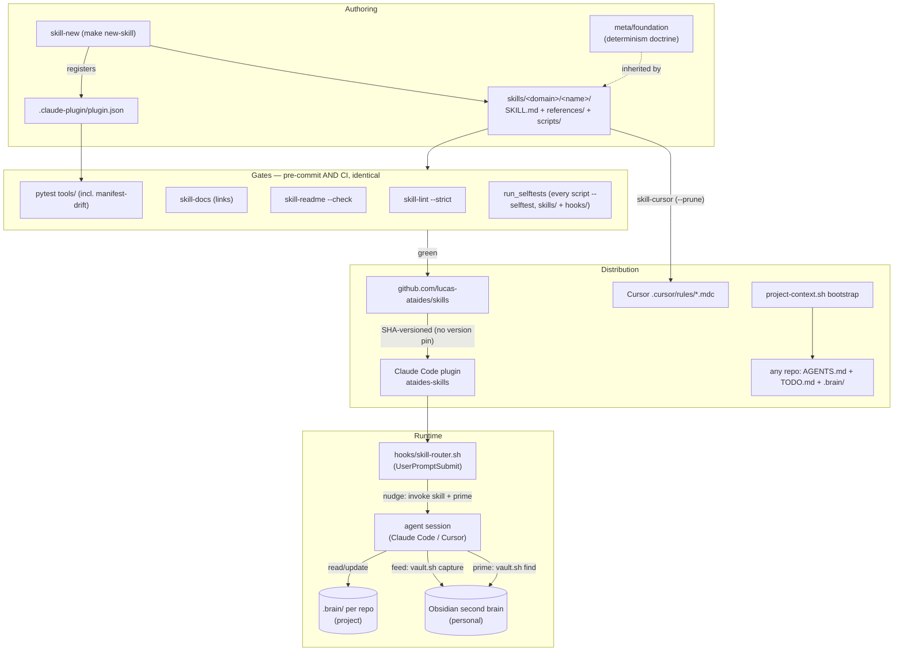

# Architecture map

The system at a glance. One pipeline: skills are **authored** against a doctrine, **gated**
deterministically, **distributed** as a plugin (and as Cursor rules), and **consumed** at
runtime by agents that read/write memory in both directions.

## Entry points
- `make lint|docs|readme|test|sca` — the gate targets; `make new-skill CATEGORY=x NAME=y`.
- `skill-*` CLIs on PATH via `uv tool install` (`scripts/install.sh`).
- `hooks/skill-router.sh` — fires on every prompt once the plugin is installed.
- Per-skill scripts under `skills/*/*/scripts/` — every one exposes `--selftest`.

## Boundaries
- **Prose never mutates.** A SKILL.md describes; a script executes. Destruction only through
  guarded helpers (`skillkit.safe_remove`, `vault.sh rm`, `check-policy.sh`).
- **Secrets live in env only** (`LINEAR_API_KEY`), never in `skills.toml` — the secret-scan
  gate is the backstop.
- **plugin.json is written by the scaffolder** and pruned by hand; the drift test makes
  manifest ≡ disk ≡ README count a hard gate.
- **The vault path resolves through `skill-config`** (`~/.config/skills/skills.toml`), never
  hardcoded.

## How to work here
- New skill: `make new-skill …`, then follow `meta/creating-skills`. Never author by hand.
- Any edit: `make lint && make test` must be green before done (Jidoka — red gate = not done).
- Push: after every push, refresh the installed plugin (`claude plugin marketplace update
  ataides-skills && claude plugin update ataides-skills@ataides-skills`) — updates apply on
  restart.
- Commit subjects ≤ 72 chars via `git-commit.sh` (it rejects longer).
