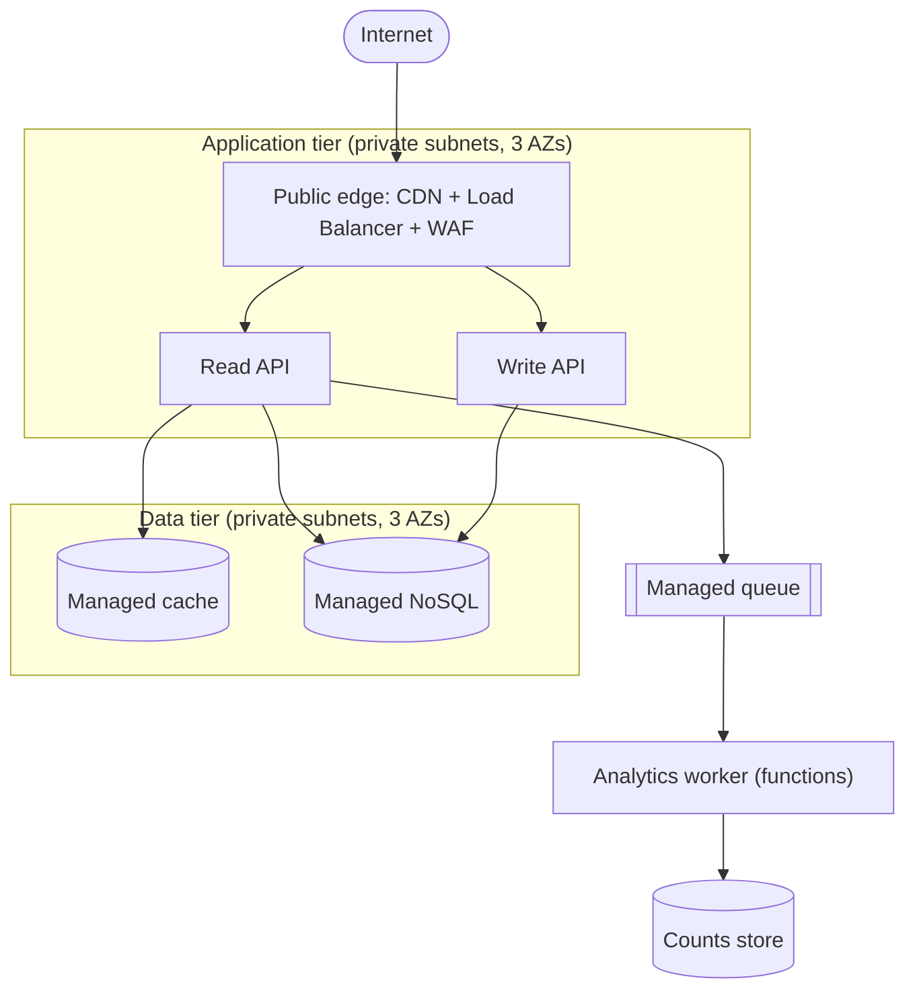

# Cloud architecture

Designing for a cloud changes the building blocks, not the method. The funnel in
[the design process](design-process.md) still runs front to back: requirements,
ranked attributes, components, data, contracts. Cloud architecture adds four decisions
on top — which building block realizes each component, where it runs, how the network
exposes it, and how it scores against the vendor's Well-Architected framework.

The governing instinct is **managed-first**: prefer the service that removes
undifferentiated heavy lifting, so owning a server is the last resort, not the first
reach. The hard part is rarely the resource; the hard part is choosing the most
managed option that still meets the constraint, then containing the blast radius.

Once the architecture names a vendor, the matching toolkit carries the service map,
the security baseline, and the IaC: [aws-toolkit](../../../cloud/aws-toolkit/SKILL.md),
[azure-toolkit](../../../cloud/azure-toolkit/SKILL.md), or
[gcp-toolkit](../../../cloud/gcp-toolkit/SKILL.md). This reference stays
vendor-neutral and stops at the architecture boundary; provisioning is the toolkit's
job, gated on a reviewed plan.

## Decision procedure

Run these four decisions after the component sketch in
[design-process step 3](design-process.md#sketch-components-and-data), once each
component's responsibility and data are named:

1. **Map each component to a building block.** Take the [build-vs-managed
   call](#build-vs-managed) per component. The step is done once every component names
   a building block and each self-hosted choice names the constraint that forced it.

2. **Place the workload in regions and zones.** Decide the region count, the
   availability-zone spread, and the data-residency boundary, per [regions, zones, and
   residency](#regions-zones-and-residency). The step is done once production names its
   zones and any residency rule names the region that satisfies it.

3. **Lay out the network.** Decide the public edge, the private tiers, and the egress
   path, per [network topology](#network-topology). The step is done once every data
   store sits in a private tier with no direct inbound path from the internet.

4. **Score against the framework.** Take a one-line stance on each [Well-Architected
   pillar](#the-well-architected-pillars). The step is done once each pillar carries a
   written stance for this workload, not a blank.

## Requirements to building blocks

A cloud component is one of a small set of building-block kinds. Map the responsibility
to the kind first, then let the chosen vendor's toolkit name the concrete service.

| Building-block kind | Realizes | Managed-first default |
|---|---|---|
| **Compute** | The code that runs a request or a job. | Functions for spiky or event work; containers-as-a-service for steady services; a VM only where an OS-level dependency forces it. |
| **Relational store** | Transactional data with joins and strong consistency. | A managed relational service (serverless tier first); a self-run database only where an extension or version is unavailable managed. |
| **Key-value / document store** | Point lookups and known access patterns at scale. | A managed NoSQL service sized to the access pattern. |
| **Object store** | Large blobs, backups, static assets. | The vendor's object storage with lifecycle rules and a private default. |
| **Cache** | A hot read in front of a slow store. | A managed in-memory cache. |
| **Queue / event bus** | Decoupling a producer from a consumer; fan-out. | A managed queue for work, a managed bus for events. |
| **Edge / CDN** | TLS termination, static delivery, DDoS absorption near the user. | The vendor's CDN and edge load balancer. |
| **Identity** | Authn and authz for users and services. | A managed identity provider; workload identity for service-to-service, never a long-lived key. |

The mapping is deterministic once the access pattern is named. A point lookup at huge
volume maps to a key-value store; a reporting query with joins maps to a relational
store; a blob maps to object storage. The access pattern, recorded back in
[design-process step 4](design-process.md#sketch-components-and-data), is the input.

## Build-vs-managed

The central cloud trade-off, taken per component. Climb the ladder and stop at the
first rung that meets the constraint:

1. **Serverless / fully managed** — the vendor owns the servers, patching, and scaling.
   Lowest operational cost; the price is less control and a per-request bill that can
   surprise at high steady volume.
2. **Managed platform (containers, managed database)** — the vendor owns the host and
   the runtime; the team owns the image or the schema. A middle rung: more control than
   serverless, far less toil than a VM.
3. **Self-hosted on a VM** — the team owns the OS, patching, scaling, and backups. The
   last rung. A self-hosted choice must name the constraint that forced it down the
   ladder — an unavailable extension, a licensing rule, a latency floor a managed hop
   cannot meet.

The decision rule: take the most managed rung that meets every recorded constraint
from [design-process step 1](design-process.md#decision-procedure). A team reaching
for a VM where a managed service fits is paying the operational bill for control it
does not need. A team reaching for serverless under a steady, predictable, high-volume
load may pay a per-request premium that a reserved container would not — the ranked
**cost** attribute decides which way that one falls.

## Regions, zones, and residency

Three placement decisions, each driven by a ranked attribute:

- **Region count.** A single region is the default and the cheapest. Multi-region buys
  lower latency for a global audience and survival of a whole-region outage; the price
  is replication complexity, cross-region data transfer cost, and the consistency
  problem of writing in two places. Reach for multi-region only when the **availability**
  or **latency** target names a number a single region cannot hit.
- **Availability zones.** Within a region, spread every stateful and stateless tier
  across at least two zones so one datacenter failure does not take production down. A
  single-AZ production deployment is a red flag, not a cost saving. The **availability**
  target sets the zone count.
- **Data residency.** A compliance regime (GDPR, data-sovereignty law, a contractual
  clause) can pin data to a geography. The residency rule selects the region before any
  latency or cost argument is heard; record it as a hard constraint in
  [design-process step 1](design-process.md#decision-procedure), because it overrides
  the other two placement decisions.

## Network topology

The default cloud network is a layered private network with one controlled door:

- **Public edge.** The CDN, the load balancer, and the WAF terminate TLS and take the
  internet's traffic. The edge is the only tier with a public address.
- **Application tier.** The compute sits in a private subnet, reachable only from the
  edge. No direct inbound path from the internet touches application code.
- **Data tier.** Every data store sits in the most private subnet, reachable only from
  the application tier through a private endpoint. No database, cache, or object store
  answers a public address.
- **Egress.** Outbound calls leave through a controlled path (a NAT gateway or an egress
  proxy), so the set of destinations the workload can reach is known.

The invariant that makes this checkable: trace the path from the internet to the
database, and at least two private boundaries sit between them. A data store with a
public address is the single most common cloud red flag.

## The Well-Architected pillars

Each major cloud vendor publishes a Well-Architected framework — overlapping pillars
that score a design against operational and economic reality. Take a one-line stance on
each; a pillar with no stance is a gap, not a default.

| Pillar | The question | A stance names |
|---|---|---|
| **Operational excellence** | Can the team run and observe it? | The logs, metrics, traces, and the deploy/rollback path. |
| **Security** | Who reaches what, and is data protected? | Least-privilege identity, encryption at rest and in transit, the trust boundary. |
| **Reliability** | Does it survive failure and recover? | The zone spread, the backups, the recovery target (RTO/RPO). |
| **Performance efficiency** | Does it meet the latency and throughput bar? | The compute sizing, the caching, the scaling trigger. |
| **Cost optimization** | Is the spend matched to the value? | The managed-vs-self rung, the right-sizing, the budget and its alert. |
| **Sustainability** | Is the resource use proportionate? | The right-sizing and the idle-capacity stance. |

The vendor toolkits carry the pillar checklists in depth:
[AWS Well-Architected](../../../cloud/aws-toolkit/references/well-architected.md),
[Azure Well-Architected](../../../cloud/azure-toolkit/references/well-architected.md), and
[GCP Architecture Framework](../../../cloud/gcp-toolkit/references/architecture-framework.md). The
architecture step records a stance; the toolkit step audits the implementation against
it.

## Failure modes and red flags

Cloud architecture fails in its own recognizable ways, on top of the
[system-design failure modes](design-process.md#failure-modes):

- **Lift-and-shift without re-architecture.** A monolith moved onto a VM in the cloud,
  paying cloud prices for datacenter design — no managed services, no elasticity.
  Counter: re-map each component to a building block before the move.
- **Single-AZ production.** Production pinned to one availability zone, one datacenter
  failure away from a full outage. Counter: spread every tier across at least two zones.
- **Resume-driven cloud.** Kubernetes for three containers, a service mesh for two
  services, multi-region for a regional audience. Counter: each platform choice traces
  to a ranked attribute with a number.
- **Public data store.** A database, cache, or bucket reachable from the internet.
  Counter: the network invariant — two private boundaries between the internet and the
  data.
- **Click-ops.** Infrastructure created by hand in the console, leaving no diff and no
  review. Counter: the design hands provisioning to the toolkit's IaC, gated on a
  reviewed plan.
- **Unbounded cost.** No budget, no alert, a serverless or per-request service under a
  steady high-volume load. Counter: the cost pillar names a budget with an alert and the
  managed-vs-reserved rung.

### Red flags

- A data store with a public address or a `0.0.0.0/0` inbound rule.
- A long-lived access key where workload identity is available.
- Production in a single availability zone.
- A VM chosen where a managed service meets every constraint, with no constraint named.
- Multi-region proposed with no availability or latency number that forces it.
- No budget and no cost alert anywhere in the design.
- A diagram that draws cloud resources but never names the network tiers between them.

## Worked example: cloud placement of the URL shortener

The [URL shortener](design-process.md#worked-example-the-url-shortener) mapped onto a
single vendor's building blocks, vendor-neutral until the toolkit hands-off.

### Building-block mapping

| Component | Building-block kind | Why |
|---|---|---|
| Edge / Load Balancer | Edge / CDN | TLS termination and DDoS absorption at the user's edge. |
| Write API, Read API | Compute (containers-as-a-service) | Steady request traffic; a container scales on CPU without VM toil. |
| Key-value store | Managed NoSQL | The access pattern is a point lookup by code at ~40k reads/sec peak. |
| Cache | Managed in-memory cache | The hot set of `code -> long_url` absorbs the redirect read volume. |
| Async queue | Managed queue | Click events leave the redirect's critical path. |
| Analytics worker | Compute (functions) | Spiky, event-triggered work; functions match the bursty load. |

### Placement

- **Region count:** single region. No data-residency rule applies, and the 99.99%
  availability target is reachable within one region across zones, so the multi-region
  cost is not justified.
- **Zones:** the compute tiers, the cache, and the NoSQL store each span three
  availability zones, so one datacenter failure leaves the redirect path serving.
- **Residency:** none recorded; the placement is free to optimize for cost and latency.

### Network

Two private boundaries sit between the internet and the NoSQL store: the public edge,
then the application tier. No data store answers a public address.

### Well-Architected stances

- **Operational excellence:** structured logs and traces on both APIs; deploy via the
  toolkit's IaC pipeline with a one-step rollback.
- **Security:** workload identity between compute and data, no long-lived keys; TLS at
  the edge; the NoSQL store and cache encrypted at rest.
- **Reliability:** three-AZ spread on every tier; point-in-time backup on the NoSQL
  store; RPO measured in minutes, RTO under an hour.
- **Performance efficiency:** the cache serves the hot set; containers autoscale on CPU;
  the p99 < 50ms target drives the cache hit-ratio goal.
- **Cost optimization:** a budget with an alert; reserved capacity on the steady-state
  container floor; object-storage lifecycle rules on old analytics data.
- **Sustainability:** autoscaling down to a small floor off-peak, so idle capacity is
  bounded.

The hand-off: the next move names a vendor and switches to that toolkit
([AWS](../../../cloud/aws-toolkit/SKILL.md), [Azure](../../../cloud/azure-toolkit/SKILL.md),
or [GCP](../../../cloud/gcp-toolkit/SKILL.md)) to turn this placement into reviewed IaC.
